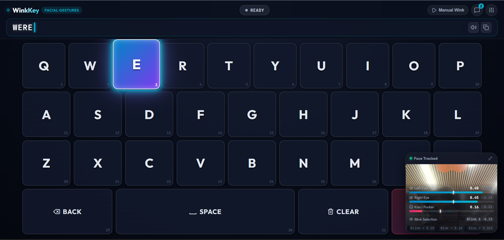
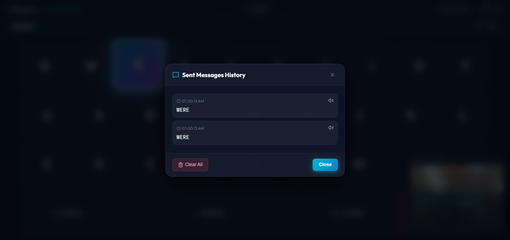
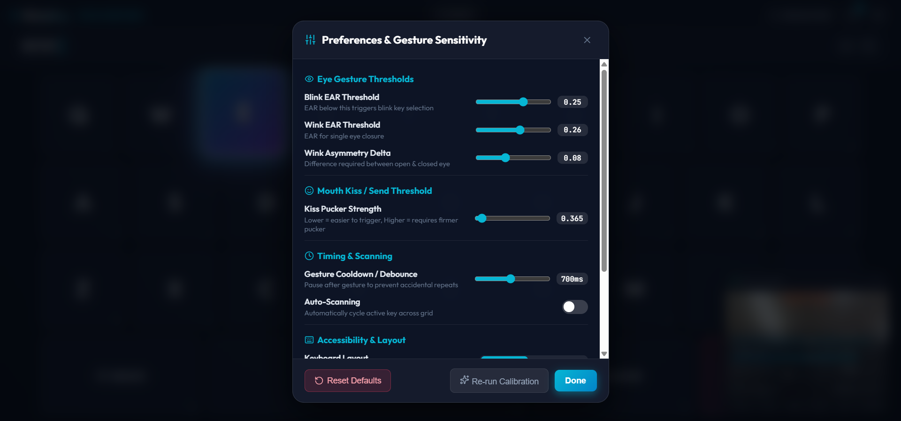
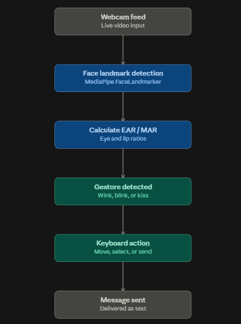

# WinkKey

## Basic Details
### Team Name: Thakkali Monnas

### Team Members
- Member 1: Vaishakh R Warriar - Adi Shankara Institute of Engineering and Technology
- Member 2: Ankita Syam - Adi Shankara Institute of Engineering and Technology

### Project Description
A full-screen virtual keyboard that you type on entirely with your face. No hands, no mouse, no physical keyboard. Wink left or right to move across the keys, blink with both eyes to select a letter, and kiss the screen to send your message.

### The Problem (that doesn't exist)
Typing with your fingers is fast, easy, and works fine. We decided that wasn't nearly inconvenient enough.

### The Solution (that nobody asked for)
WinkKey watches your face through the webcam in real time using facial landmark detection. It tracks how open your eyes are and how puckered your lips are, then turns that into keyboard input: left wink moves left, right wink moves right, a full blink selects the highlighted key, and a kiss sends the message. A calibration step tunes all of this to your specific face before you start typing.

## Technical Details
### Technologies/Components Used
For Software:
- JavaScript, HTML, CSS
- React, Vite
- MediaPipe FaceLandmarker (@mediapipe/tasks-vision)
- Web Audio API (sound feedback)
- Web Speech API (text-to-speech)

For Hardware:
- Laptop/PC with a webcam
- No additional hardware required

### Implementation
For Software:
# Installation
```
npm install
```

# Run
```
npm run dev
```

### Project Documentation
For Software:

# Screenshots 

*Main WinkKey interface showing real-time webcam face tracking HUD, active key highlighting, and live message drafting.*


*Message history drawer showing previously sent messages with timestamps and text-to-speech audio replay.*


*Customizable sensitivity preferences for Blink EAR, Wink EAR asymmetry delta, Kiss / lip pucker strength, and debounce timings.*

# Diagrams

*Camera input flows through MediaPipe face landmark detection, EAR/MAR calculation, gesture classification, and keyboard action, ending in the sent message.*

# Video
[Watch WinkKey Demo Video](uploads/Screen%20Recording%20Useless.mp4)

*Demonstration of WinkKey in action: webcam face tracking, navigating keys with left/right winks, selecting characters via blinks, and sending messages using the kiss/pucker gesture.*

## Team Contributions
- Ankita Syam: Built the keyboard UI, calibration wizard, gesture-to-keyboard integration, threshold tuning, debugging, and full project documentation
- Vaishakh R Warriar: Contributed to the facial gesture detection logic (MediaPipe integration, EAR/MAR calculations for wink/blink/kiss classification)

---
Made with ❤️ at TinkerHub Useless Projects 


